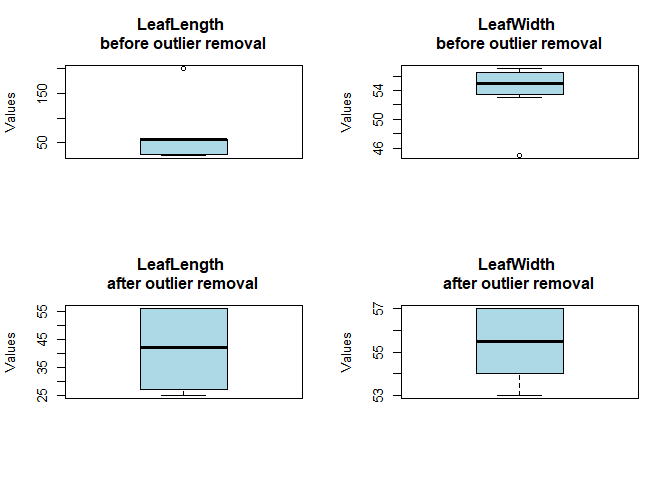

<!-- README.md is generated from README.Rmd. Please edit that file -->

# LeafArea

<!-- badges: start -->
<!-- badges: end -->

The goal of LeafArea is to facilitate the calculation of leaf area in
plants using predictor variables such as length, width, and species
type. The package is currently capable of estimating leaf area for six
important Andean fruit species, including *S. quitoense*, *S. betaceum*,
*P. peruviana*, *R. fruticosus*, *P. ligularis*, and *P. edulis*.

Leaf area is a critical parameter in plant physiology and ecology,
influencing various aspects of plant growth, development, and
environmental interactions. The LeafArea package leverages predictor
variables, such as leaf length and width, along with species-specific
information, to provide accurate estimations of leaf area for the
specified Andean fruit species.

## Key Features

- Leaf Area Calculation: Perform precise calculations of leaf area based
  on input variables, including length, width, and species type.

- Species-Specific Estimations: The package is tailored to accommodate
  the characteristics of six major Andean fruit species -*S. quitoense*,
  *S. betaceum*, *P. peruviana*, *R. fruticosus*, *P. ligularis*, and
  *P. edulis*— ensuring accurate and species-specific estimations.

- User-Friendly Interface: LeafArea is designed to offer a user-friendly
  interface, making it accessible to researchers, agronomists, and plant
  scientists interested in obtaining reliable leaf area measurements for
  Andean fruit species.

Future Developments:

The LeafArea package is continuously evolving, with plans to expand its
capabilities to cover additional plant species and incorporate advanced
functionalities. We welcome contributions from the community to enhance
the package’s versatility and applicability in diverse research
settings.

## Installation

You can install the development version of LeafArea from
[GitHub](https://github.com/) with:

``` r
# install.packages("devtools")
devtools::install_github("velasquez-vasconez/LeafArea")
```

## Example

This is a basic example which shows you how to calculate Leaf Area:

``` r
library(LeafArea)

df <- data.frame(
   Culture = c("S. quitoense", "S. quitoense", "S. quitoense", "S. quitoense",
               "S. quitoense", "S. quitoense", "S. betaceum", "S. betaceum",
               "S. betaceum", "S. betaceum", "S. betaceum", "S. betaceum"),
   LL = c(25, 27, 200, 56, NA, 56, 25, 27, 28, 56, 56, 56),
   LW = c(45, 56, 57, 53, 54, NA, 57, 56, 57, 53, 54, 55)
 )

sp <- df$Culture
LeafLength <- df$LL
LeafWidth <- df$LW
df_example <- data.frame(sp, LeafLength, LeafWidth)

# Use the outlier_treatment_mice function
df_result_outlier <- LeafArea::outlier_treatment_mice(df_example)
```



    #> Outliers removed from LeafLength : 200 
    #> Outliers removed from LeafWidth : 45 
    #> 
    #>  iter imp variable
    #>   1   1  LeafLength  LeafWidth
    #>   1   2  LeafLength  LeafWidth
    #>   1   3  LeafLength  LeafWidth
    #>   1   4  LeafLength  LeafWidth
    #>   1   5  LeafLength  LeafWidth
    #>   2   1  LeafLength  LeafWidth
    #>   2   2  LeafLength  LeafWidth
    #>   2   3  LeafLength  LeafWidth
    #>   2   4  LeafLength  LeafWidth
    #>   2   5  LeafLength  LeafWidth
    #>   3   1  LeafLength  LeafWidth
    #>   3   2  LeafLength  LeafWidth
    #>   3   3  LeafLength  LeafWidth
    #>   3   4  LeafLength  LeafWidth
    #>   3   5  LeafLength  LeafWidth
    #>   4   1  LeafLength  LeafWidth
    #>   4   2  LeafLength  LeafWidth
    #>   4   3  LeafLength  LeafWidth
    #>   4   4  LeafLength  LeafWidth
    #>   4   5  LeafLength  LeafWidth
    #>   5   1  LeafLength  LeafWidth
    #>   5   2  LeafLength  LeafWidth
    #>   5   3  LeafLength  LeafWidth
    #>   5   4  LeafLength  LeafWidth
    #>   5   5  LeafLength  LeafWidth

    df_result<-calculate_LeafArea_rf(df_result_outlier)
    #> 
    #> ---------------------------------------------
    #> 
    #> [1] "RMSE of test set: 85.58"
    #> [1] "MAE of test set: 34.08"
    #> [1] "MAPE of test set: 27.68 %"
    #> [1] "R2 of test set: 0.93"
    #> 
    #> ---------------------------------------------
    #> 
    #> [1] "RMSE of training set: 61.71"
    #> [1] "MAE of training set: 24.66"
    #> [1] "MAPE of training set: 16.29 %"
    #> [1] "R2 of training set: 0.98"
    #> Performance Metrics of Random Forest model:
    #> Random Forest 
    #> 
    #> 686 samples
    #>   3 predictor
    #> 
    #> No pre-processing
    #> Resampling: Cross-Validated (6 fold, repeated 2 times) 
    #> Summary of sample sizes: 572, 571, 572, 570, 573, 572, ... 
    #> Resampling results across tuning parameters:
    #> 
    #>   mtry  RMSE      Rsquared   MAE      
    #>    1    177.5703  0.8771132  103.30540
    #>    2    125.3285  0.9178973   58.61501
    #>    3    113.7556  0.9298786   48.31399
    #>    4    111.5593  0.9296204   46.14349
    #>    5    110.7717  0.9283817   45.94924
    #>    6    111.8986  0.9261280   46.59196
    #>    7    111.7041  0.9253284   46.73040
    #>    8    112.7635  0.9242899   46.98357
    #>    9    111.8227  0.9251477   46.74893
    #>   10    112.2635  0.9245817   46.85579
    #> 
    #> RMSE was used to select the optimal model using the smallest value.
    #> The final value used for the model was mtry = 5.
    #> 
    #> ---------------------------------------------

    # Print the resulting dataset
    print(df_result)
    #>              sp LeafLength LeafWidth LeafArea_rf_model
    #> 1  S. quitoense         25        57          865.7186
    #> 2  S. quitoense         27        56          890.6963
    #> 3  S. quitoense         25        57          865.7186
    #> 4  S. quitoense         56        53         1363.6698
    #> 5  S. quitoense         56        54         1437.1033
    #> 6  S. quitoense         56        54         1437.1033
    #> 7   S. betaceum         25        57          854.2243
    #> 8   S. betaceum         27        56          883.9005
    #> 9   S. betaceum         28        57          883.5648
    #> 10  S. betaceum         56        53         1332.2124
    #> 11  S. betaceum         56        54         1399.8806
    #> 12  S. betaceum         56        55         1403.4906

## Contributing

We welcome contributions from the community. If you find a bug, have a
feature request, or want to contribute to the development of LeafArea,
please follow these steps:

1.  Check if an issue already exists in the [issue
    tracker](https://github.com/pavelasquezvasconez/LeafArea/issues). If
    not, open a new issue, providing as much detail as possible.

2.  If you’re interested in contributing code, please fork the
    repository and submit a pull request. Make sure to follow our coding
    guidelines and maintain clear commit messages.

3.  Help us improve the documentation by fixing typos, improving
    explanations, or adding examples.

Your contributions are greatly appreciated.
